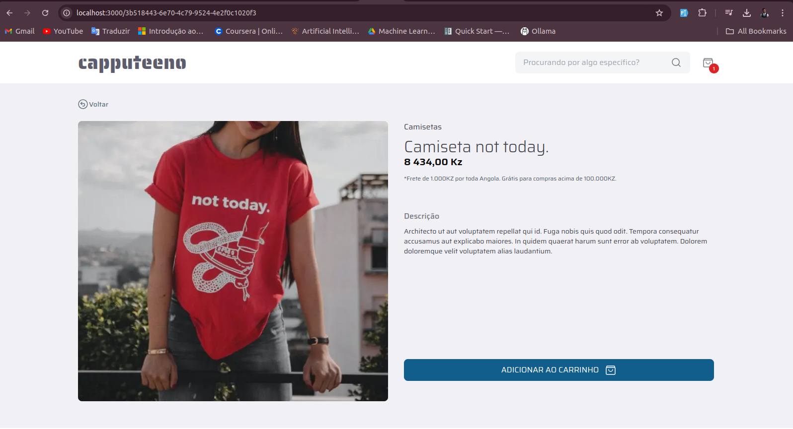
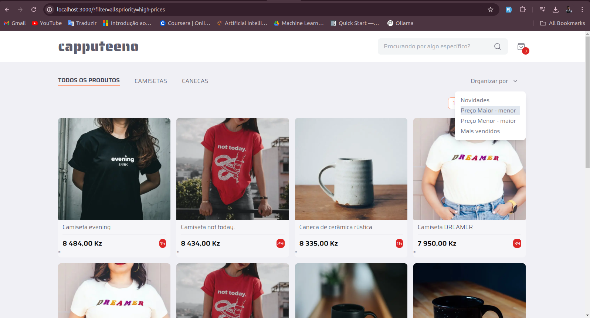
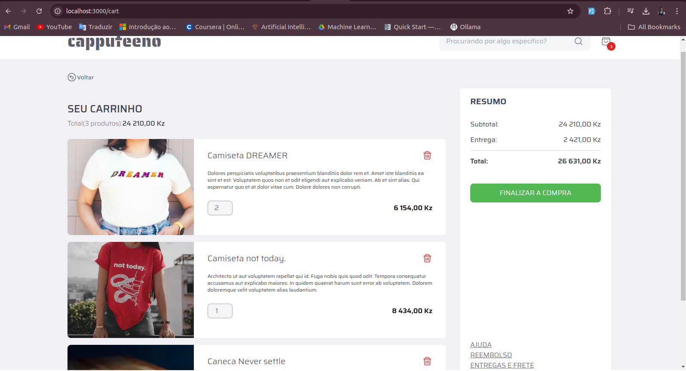

[TYPESCRIPT__BADGE]: https://img.shields.io/badge/typescript-D4FAFF?style=for-the-badge&logo=typescript
[TailwindCSS_BADGE]: https://img.shields.io/badge/tailwindcss-%2338B2AC.svg?style=for-the-badge&logo=tailwind-css&logoColor=white
[NEXT_BADGE]: https://img.shields.io/badge/Next-black?style=for-the-badge&logo=next.js&logoColor=white
[PROJECT__BADGE]: https://img.shields.io/badge/📱Visit_this_project-000?style=for-the-badge&logo=project
[PROJECT__URL]: https://portfolio-1f6u.vercel.app/
[VERCEL_BADGE]: https://img.shields.io/badge/vercel-%23000000.svg?style=for-the-badge&logo=vercel&logoColor=white


<h1 align="center" style="font-weight: bold;">frontend challenge - Capputeeno  💻</h1>


Welcome! This repository contains my solution for [Rocketseat´s](https://www.rocketseat.com.br/ignite?utm_source=influencer&utm_medium=publipost&utm_campaign=lead&utm_term=ignite&utm_content=lead-ignite-publipost-organic-cupom_KIPPERDEV-none-none-none-none-redes_kipperdev&referral=kipperdev&coupon=KIPPERDEV@IGNITE) open source [Frontend Challenge](https://github.com/Rocketseat/frontend-challenge).


![next][NEXT_BADGE]
![typescript][TYPESCRIPT__BADGE]
![TailwindCss][TailwindCSS_BADGE]
<!-- ![Vercel][VERCEL_BADGE] -->


`Content:`
<p align="center">
 <a href="#about">About</a>  • 
 <a href="#requirements">Challenges Requirements</a>  • 
 <a href="#utilLinks">Utils Links</a>  • 
 <a href="#installation">Installation</a>  • 
 <a href="#prerequisites">Prerequisites</a> • 
 <a href="#run-backend">Running the API (Backend)</a> • 
 <a href="#run-frontend">Running Frontend</a> • 
 <a href="#results">Results</a> • 
 <a href="#collaborators">Collaborators</a> • 
 <a href="#license">License</a> • 
</p>

<h2 id="about">🧠 About</h2>

<p>
The goal of this project is to enhance my frontend development skills using Next.js, tailwindCss and TypeScript, with a focus on server components and their iterations. This project provides an opportunity to explore new approaches to solving technical challenges, particularly in consuming GraphQL APIs.
</p>

<p>
The challenge is to implement an e-commerce platform for selling mugs and t-shirts, featuring the following functionalities:
</p>

- [x] Product catalog with pagination
- [x] Filter products by category
- [x] Search by product name
- [x] Add and remove products from cart
- [ ] Checkout

<h2 id="requirements">📋 Challenges Requirements</h2>


- Follow [this prototype](https://www.figma.com/file/rET9F2CeUEJdiVN7JRu993/E-commerce---capputeeno?node-id=680%3A6449)
- Use Next.js and Typescript
- Create components with styled-components (I made it with TailwindCss)
- consume from the provided **GraphQL API**


<h2 id="utilLinks">🔗 Utils Links</h2>

1. <a href="https://www.figma.com/file/rET9F2CeUEJdiVN7JRu993/E-commerce---capputeeno?node-id=680%3A6449">Challenge Figma</a>
2. <a href="https://github.com/Rocketseat/frontend-challenge">Project Original Challenge</a>


<h2 id="installation">🖥️ Installation</h2>

This section describes how to run the project locally.

<h3 id="prerequisites">Pre-requisites</h3>

Here you list all prerequisites necessary for running your project. For example:

- NodeJS
- npm
- TypeScript
- Git 


<h3 id="run-backend"> Running the API (Backend)</h3>

1. Clone this repo
```bash
git clone https://github.com/EriveltoSilva/frontend-challenge.git
```

2. Go to the API folder
```bash
cd frontend-challenge
cd api
```

3. Install dependencies
```bash
npm install
```

3. Run start
```bash
npm start
```

<h3 id="run-frontend">Running Frontend</h3>

1. Clone this repo
```bash
git clone https://github.com/EriveltoSilva/frontend-challenge.git
```

2. Go to the project folder
```bash
cd frontend-challenge
```

3. Install dependencies
```bash
npm install
```

3. Run Frontend
```bash
npm run dev
```

<h2 id="results">📌 Results</h2>

<p align="center">
    
    
    
</p>

<h2 id="collaborators">🤝 Collaborators</h2>

Special thank you for all people that contributed for this project.

<table>
  <tr>
    <td align="center">
      <a href="#">
        <br>
        <sub>
          <b>Erivelto Silva</b>
        </sub>
      </a>
    </td>
  </tr>
</table>

<h2 id="license">📓 License</h2>

This project is licensed under the <a href="./LICENSE">MIT License</a>. See the LICENSE file for more information.
